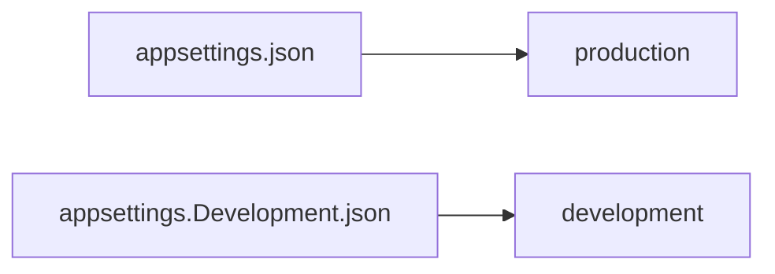

## Environment-Based Settings


Production != Development :
- urls
- ports
- connection strings
- passwords
- others sensitives informations

For production we should add another file : `appsettings.Production.json`
>Should contain production environment configuration

To set running environment -> set up ASPNETCORE_ENVIRONMENT environment variable

>Windows
>>```bash
>>set ASPNETCORE_ENVIRONMENT=Production
>>``` 
>Linux
>>```bash
>>export ASPNETCORE_ENVIRONMENT=Production
>>```
>
>ASP.NET Core use value of the environment variable to choose appsettings

## ASP.NET Core Middleware

Code use to handle requests and responses.
Code section that executes with every request.

More than a single middleware component in app.
Each component can:
- Pass the request to the next middleware component in the pipeline and also
- It can execute some work before and after the next component in the pipeline

To build a pipeline -> use of request delegates
=> handle each HTTP request

Configure request delegates (extension methods):
- Run
- Map
- Use

Execute component in the same order, placed in the code (top to bottom):


Can execute custom logic before using `next` delegate to pass the execution to another component.
-> the last doesn't call `next`, execute additional logic and returns the execution to the previous middleware components.

### Importance of the order

The order is important for the security, performance and functionality


ExceptionHandler = First => catch exceptions

When create new ASP.NET Core app => many middleware component already registered in the order from the diagram

HAVE TO PAY ATTENTION FOR ADDITIONAL OR CUSTOM COMPONENTS

=> to see : MiddlewareExample project

`Run`is always terminal and terminates the pipeline
It accepts a single parameter of the RequestDelegate type which accepts a single HttpContext parameter.

```csharp
 public static void Run(this IApplicationBuilder app, RequestDelegate handler)
    {
      ArgumentNullException.ThrowIfNull((object) app, nameof (app));
      ArgumentNullException.ThrowIfNull((object) handler, nameof (handler));
      app.Use((Func<RequestDelegate, RequestDelegate>) (_ => handler));
    }
```

```csharp
namespace Microsoft.AspNetCore.Http
{
public delegate Task RequestDelegate(HttpContext context);
}
```


## Working with the use method

>To chain multiple request delegates => `Use` method:
>>Accepts a `Func` delegate as parameter
> 
>>Returns a `Task` as result
> 
> >```csharp
> >public static IApplicationBuilder Use(this IApplicationBuilder app, Func<HttpContext, Func<Task>, Task> middleware);
> >```

We can make use of two parameters, `context`and `next`.

## Using the Map and MapWhen Methods

=> To branch the middleware pipeline.

Map = extension method => one parameter `string` = path

```csharp
public static IApplicationBuilder Map(this IApplicationBuilder app, PathString pathMatch, Action<IApplicationBuilder> configuration)
```

If we provide `pathMatch`, `Map`will compare it to the start of the request path.
If they match => app execute the branch.

Any middleware component added after the `Map` method in the pipeline won't be executed.

### Using MapWhen Method

```csharp
public static IApplicationBuilder MapWhen(this IApplicationBuilder app,
Func<HttpContext, bool> predicate, Action<IApplicationBuilder> configuration)
```

Uses the result of given predicate to branch the request pipeline

# Configuring a logging service

Not easy to debug in production => Log messages

.NET Cors has its implementation but we use external library NLog
because having abstraction allow to have any logger behind our interface
-> we can start with NLog and can switch to any other logger
 -> interface will still work because of our abstraction

## Creating th ILoggerManager Interface and installing NLog

Logger service will contain 4 methods:
- Info messages
- Debug messages
- Warning messages
- Error messages

-> Create an interface `ILoggerManager` inside `Contracts` which contains this 4 methods

```csharp
namespace Contracts;

public interface ILoggerManager
{
    void LogInfo(string message);
    void LogWarn(string message);
    void LogDebug(string message);
    void LogError(string message);
}
```

-> install the nuget NLOG

### Configuring Logger Service for Logging Messages

we add the path to the nlog.config through our main project
```csharp
LogManager.LoadConfiguration(string.Concat(Directory.GetCurrentDirectory(), "/nlog.config"));
```

Attention aux chemins sur (mac et linux dans la configuration des chemins)

>Three ways to add logger service in our IOC container
> >`services.AddSingleton`
> > >Create service first time we request and then every request will call the same instance of the service.
> > >All components share the same service every time they need
> 
> >`services.AddScoped`
> > >Create once per request
> > >At each HTTP request a new instance will be create
> 
> >`services.AddTransient`
> > >Create a service each time the application requests it.
> > >It will create a new instance for every single component request.

-> Add new method in the `ServiceExtension`

```csharp
public static void ConfigureLoggerService(this IServiceCollection services) =>
services.AddSingleton<ILoggerManager, LoggerManager>();
```

Everytime we want to use a logger service, all we need to do is to inject it into the constructor of the class that needs it.
.NET Core will resolve that service and the logging features will be available.

=>(Call) Dependency Injection

## DI, IoC and Logger Service Testing

What is Dependency Injection (DI) exactly and what is IoC (Inversion of Control) ?

DI => technique to achieve decoupling of objects and their dependencies
 -> Instead of instantiating an object explicitly in a class every time we need it
  -> instantiate it once and then send it to the class

In DI design may many class requesting dependencies via constructors
-> in this case -> helpful to have a class manages and provides dependencies to classes
-> these classes are referred to as containers => Inversion of Control containers.

IoC containers is essentially a factory -> responsible for providing instances of the types that are requested from it.

# Onion Architecture

Form of layered architecture => concentric circles (Jeffrey Palermo)

Split in 4 layers:
- Domain layer
- Service layer
- Infrastructure layer
- Presentation layer


All layers interact with each other strictly through interfaces.
The flow of dependencies is toward the core of the onion.

Using dependency inversion throughout the project, depending on abstractions (interfaces) and not the implementations, allows us to switch out the implementation at runtime transparently.
We are depending on abstractions at compile-time, which gives us strict contracts to work with, and we are being provided with the implementation at runtime.

-> abstraction = High testability
-> easily mock
-> can write business logic without concern about any implementations details
-> can consume external system or service creating interface for it
-> no worry about how to implement interface

## flow of dependencies

Onion architecture main idea -> flow of dependencies or how layers interact with each other
deeper the layer reside inde the Onion => fewer dependencies

Domain layer does not have any direct dependencies on the outside layers
-> isolated (from outside world)

The layers are allowed to reference the layers that are directly below them in the hierarchy

all the dependencies in the Onion architecture flow inwards.

why is important ?

Flow of dependencies dictates what a certain layer in the Onion architecture can do !
-> depends on the layer below in the hierarchy
 -> can only call methods that are exposed by the lower layers

We can use lower layers to define contracts or interfaces.
-> the outer layers implement these interfaces
  => Domain are not concerning with infrastructure details such as database or external services

We can encapsulate all of the rich business logic in the Domain and Service layers without ever having to know any implementation details.
In the service layer, depend only on the interfaces defined by the layer below => Domain layer

## Creating Models

