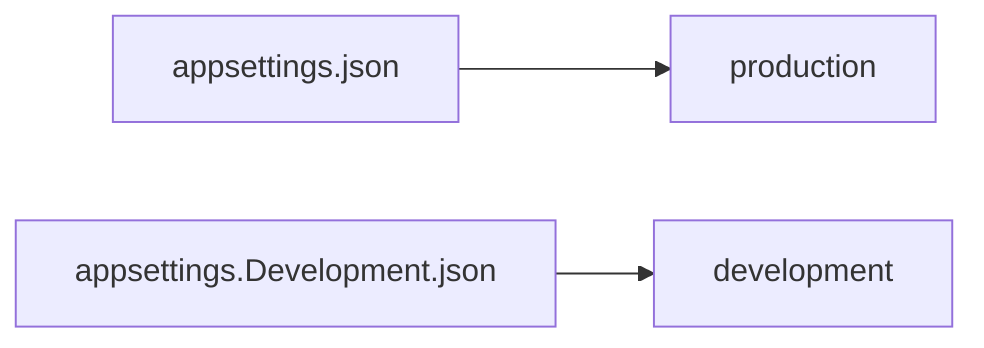

## Environment-Based Settings


Production != Development :
- urls
- ports
- connection strings
- passwords
- others sensitives informations

For production we should add another file : `appsettings.Production.json`
>Should contain production environment configuration

To set running environment -> set up ASPNETCORE_ENVIRONMENT environment variable

>Windows
>>```bash
>>set ASPNETCORE_ENVIRONMENT=Production
>>``` 
>Linux
>>```bash
>>export ASPNETCORE_ENVIRONMENT=Production
>>```
>
>ASP.NET Core use value of the environment variable to choose appsettings

## ASP.NET Core Middleware

Code use to handle requests and responses.
Code section that executes with every request.

More than a single middleware component in app.
Each component can:
- Pass the request to the next middleware component in the pipeline and also
- It can execute some work before and after the next component in the pipeline

To build a pipeline -> use of request delegates
=> handle each HTTP request

Configure request delegates (extension methods):
- Run
- Map
- Use

Execute component in the same order, placed in the code (top to bottom):

