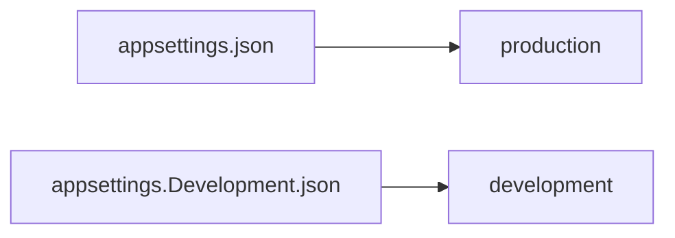

## Environment-Based Settings


Production != Development :
- urls
- ports
- connection strings
- passwords
- others sensitives informations

For production we should add another file : `appsettings.Production.json`
>Should contain production environment configuration

To set running environment -> set up ASPNETCORE_ENVIRONMENT environment variable

>Windows
>>```bash
>>set ASPNETCORE_ENVIRONMENT=Production
>>``` 
>Linux
>>```bash
>>export ASPNETCORE_ENVIRONMENT=Production
>>```
>
>ASP.NET Core use value of the environment variable to choose appsettings

## ASP.NET Core Middleware

Code use to handle requests and responses.
Code section that executes with every request.

More than a single middleware component in app.
Each component can:
- Pass the request to the next middleware component in the pipeline and also
- It can execute some work before and after the next component in the pipeline

To build a pipeline -> use of request delegates
=> handle each HTTP request

Configure request delegates (extension methods):
- Run
- Map
- Use

Execute component in the same order, placed in the code (top to bottom):


Can execute custom logic before using `next` delegate to pass the execution to another component.
-> the last doesn't call `next`, execute additional logic and returns the execution to the previous middleware components.

### Importance of the order

The order is important for the security, performance and functionality


ExceptionHandler = First => catch exceptions

When create new ASP.NET Core app => many middleware component already registered in the order from the diagram

HAVE TO PAY ATTENTION FOR ADDITIONAL OR CUSTOM COMPONENTS

=> to see : MiddlewareExample project

`Run`is always terminal and terminates the pipeline
It accepts a single parameter of the RequestDelegate type which accepts a single HttpContext parameter.

```csharp
 public static void Run(this IApplicationBuilder app, RequestDelegate handler)
    {
      ArgumentNullException.ThrowIfNull((object) app, nameof (app));
      ArgumentNullException.ThrowIfNull((object) handler, nameof (handler));
      app.Use((Func<RequestDelegate, RequestDelegate>) (_ => handler));
    }
```

```csharp
namespace Microsoft.AspNetCore.Http
{
public delegate Task RequestDelegate(HttpContext context);
}
```


## Working with the use method

>To chain multiple request delegates => `Use` method:
>>Accepts a `Func` delegate as parameter
> 
>>Returns a `Task` as result
> 
> >```csharp
> >public static IApplicationBuilder Use(this IApplicationBuilder app, Func<HttpContext, Func<Task>, Task> middleware);
> >```

We can make use of two parameters, `context`and `next`.

## Using the Map and MapWhen Methods

=> To branch the middleware pipeline.

Map = extension method => one parameter `string` = path

```csharp
public static IApplicationBuilder Map(this IApplicationBuilder app, PathString pathMatch, Action<IApplicationBuilder> configuration)
```

If we provide `pathMatch`, `Map`will compare it to the start of the request path.
If they match => app execute the branch.

Any middleware component added after the `Map` method in the pipeline won't be executed.

### Using MapWhen Method

```csharp
public static IApplicationBuilder MapWhen(this IApplicationBuilder app,
Func<HttpContext, bool> predicate, Action<IApplicationBuilder> configuration)
```

Uses the result of given predicate to branch the request pipeline

# Configuring a logging service

